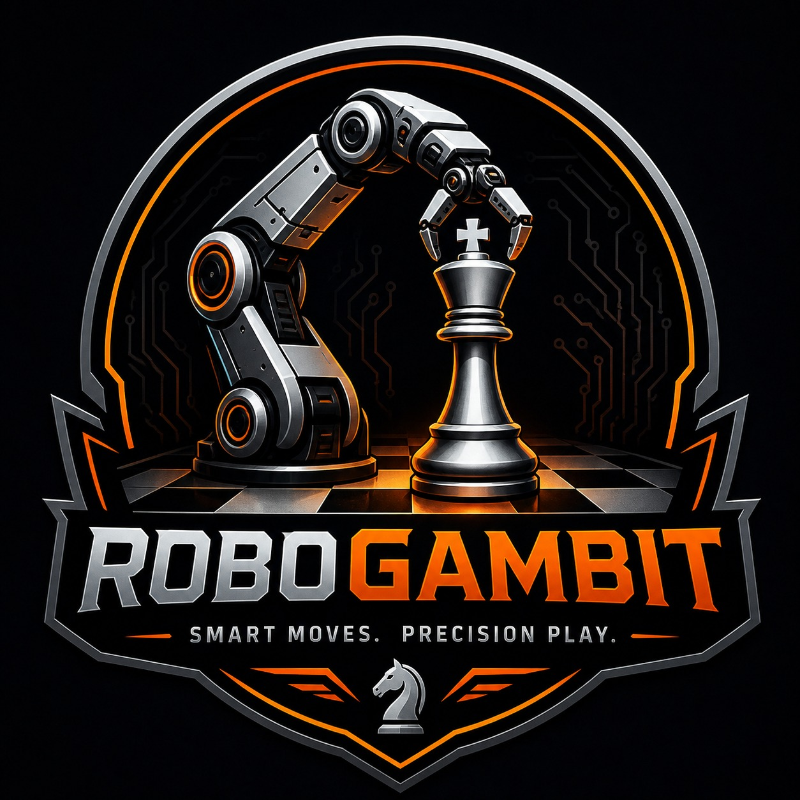
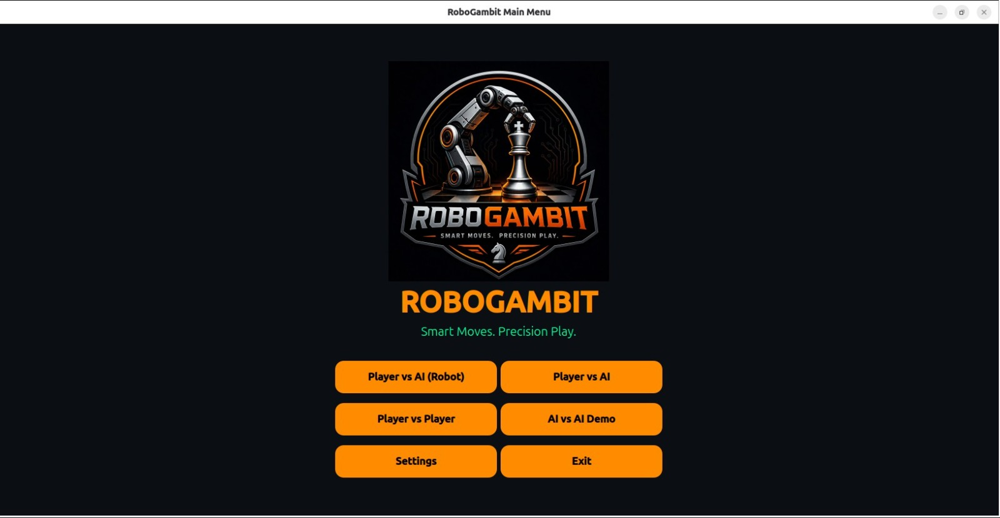
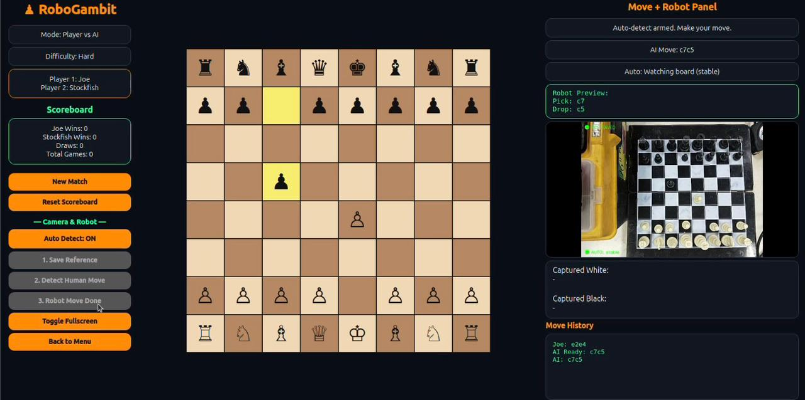
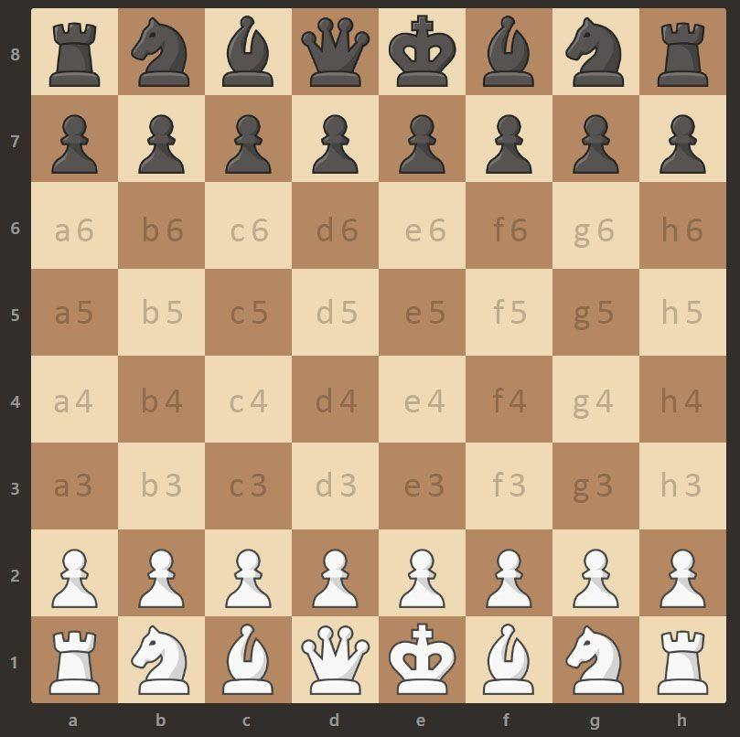

<p align="center">
  
</p>

<h1 align="center">♟ RoboGambit — The AI Chess Robot</h1>

<p align="center">
  🤖 Robotic Arm • 📷 Computer Vision • 🧠 Stockfish AI • 🎮 PySide6 GUI
  <br/>
  🎓 <em>Academic Project — Intelligent Robotics Course</em>
</p>

---

> 📑 [**View Project Presentation (PDF)**](docs/RoboGambit_Presentation.pdf)
 
## 🧠 Overview

**RoboGambit** is a full-stack chess-playing robotic system that turns a real chessboard into an intelligent opponent.

A camera watches the board, computer vision detects the human's move, **Stockfish** computes the best reply, and a **5-DOF robotic arm** physically picks up and places the piece — all while a polished GUI mirrors the game in real time.

It's chess against a robot that **sees, thinks, and moves**.

---

## ✨ Key Features

### 📷 Computer Vision
- 🎯 **One-time board calibration** maps each square to pixel coordinates
- 🔍 **Move detection via frame differencing** — figures out *from-square → to-square* automatically
- ⚡ **Auto-detect mode** with motion-then-stillness state machine — no buttons, just play
- 🎥 Live camera preview embedded in the GUI

### 🧠 AI Brain
- ♟ **Stockfish engine** integrated via `python-chess`
- 🎚 Three difficulty levels: Easy, Medium, Hard
- 💡 **Smart move hints** — toggleable per player
- 🚦 Full rule support: captures, castling, en passant, promotion

### 🤖 Robotic Arm Control
- 📡 **ROS 2 architecture** with cleanly separated publisher / IK / serial nodes
- 🎯 Lookup-table-based pick-and-place (calibrated per-square)
- 🪦 Automatic graveyard handling for captured pieces
- 🔌 Arduino Nano firmware drives the 5 servos

### 🎮 GUI Modes
| Mode | Description |
|---|---|
| 🤖 **Player vs AI (Robot)** | Play physically on the real board — robot moves the AI's pieces |
| ♟ **Player vs AI** | Play on screen against Stockfish, no hardware needed |
| 👥 **Player vs Player** | Two humans, with optional per-player AI hints |
| 🎬 **AI vs AI Demo** | Watch two Stockfish instances battle |

Plus: 🎯 **capture-square highlighting**, 🏆 **scoreboard**, ⏱ **move history**, 🌗 **dark theme**, 🖥 **fullscreen**.

---

## 📷 The System in Action

### 🎮 GUI Demo

> ▶️ [**Click to watch the GUI demo video**](assets/Demo_Video.mp4)

### 🖼 GUI Screenshots

<p align="center">
  
</p>
<p align="center"><em>Main menu — pick from four game modes</em></p>

<p align="center">
  
</p>
<p align="center"><em>In-game view — board, live camera feed, move history, and robot status</em></p>

### 🎯 Calibrated Chessboard

The vision system maps each of the 64 squares to its pixel polygon, enabling per-square motion detection:

<p align="center">
  
</p>

### 🦾 The Robot Arm

<!-- TODO: replace with actual hardware photo once the build is finalized -->
<p align="center">
  <em>📸 Hardware photo coming soon</em>
</p>

---

## 🏗 System Architecture

```
       ┌─────────────────────────┐
       │   📷 Camera (DroidCam)  │
       └────────────┬────────────┘
                    │ frames
                    ▼
       ┌─────────────────────────┐         ┌──────────────────────┐
       │  🎮 PySide6 GUI         │  ◄────  │  🧠 Stockfish        │
       │  • Vision worker        │         │  (via python-chess)  │
       │  • Auto-detect FSM      │         └──────────────────────┘
       │  • Board state          │
       │  • Robot publisher      │
       └────────────┬────────────┘
                    │ /robogambit/move ("e2e4")
                    ▼
       ┌─────────────────────────┐
       │  🧮 IK Translator Node  │
       │  (chess square → angles)│
       └────────────┬────────────┘
                    │ /nano_serial ("90,45,120,60,30")
                    ▼
       ┌─────────────────────────┐
       │  🔌 Serial Bridge Node  │
       │  (USB to Arduino)       │
       └────────────┬────────────┘
                    │ 115200 baud
                    ▼
       ┌─────────────────────────┐
       │  🤖 Arduino + 5 Servos  │
       └─────────────────────────┘
```

---

## 📂 Repository Structure

```
robogambit/
├── main.py                          # Entry point
├── config/                          # Camera, paths, thresholds, ROS topics
├── engine/                          # Stockfish wrapper
├── gui/                             # PySide6 windows (menu + game)
├── vision/                          # Calibration + move detector + QThread worker
├── robot/                           # Backend interface (Fake / ROS publisher)
├── assets/                          # Logo, demo video, screenshots
├── ros2_ws/src/robogambit_ik/       # ROS 2 package
│   ├── robogambit_ik/
│   │   ├── ik_node.py               # Chess move → servo angles
│   │   ├── serial_node.py           # ROS → Arduino USB bridge
│   │   ├── calibrate_arm.py         # Interactive arm calibration
│   │   └── arm_config.json          # Per-square servo angles
│   └── arduino/
│       └── chess_arm_controller/    # Arduino Nano firmware
└── requirements.txt
```

---

## 🚀 How to Run

### 1️⃣ Software Setup (Ubuntu 22.04+)

```bash
sudo apt install -y stockfish python3-pip python3-venv
git clone https://github.com/MohamedEldairouty/RoboGambit.git
cd RoboGambit
python3 -m venv venv --system-site-packages
source venv/bin/activate
pip install -r requirements.txt
```

### 2️⃣ Calibrate the Camera (one-time)

Mount your camera (or phone via DroidCam) and run:

```bash
python -m vision.calibrate
```

Click the 4 corners of the board → press `s` to save.

### 3️⃣ Run the GUI

```bash
python main.py
```

That's enough for **Player vs AI**, **PvP**, and **AI vs AI Demo** modes.

### 4️⃣ For Robot Mode (with hardware)

Install ROS 2 Jazzy, then:

```bash
cd ros2_ws
colcon build --packages-select robogambit_ik
source install/setup.bash

# Calibrate arm positions (one-time, ~30 minutes):
ros2 run robogambit_ik calibrate_arm

# Then in 3 separate terminals:
ros2 run robogambit_ik serial_node    # USB ↔ Arduino bridge
ros2 run robogambit_ik ik_node        # Chess moves → servo angles
python main.py                        # The GUI
```

Set `ROBOT_BACKEND = "ros"` in `config/settings.py` to enable the publisher.

---

## 🛠 Technologies Used

| Layer | Tools |
|---|---|
| **GUI** | PySide6 (Qt) |
| **Vision** | OpenCV, NumPy |
| **AI** | Stockfish, python-chess |
| **Robotics** | ROS 2 Jazzy, rclpy, std_msgs |
| **Hardware** | Arduino Nano, 5× servos, USB serial |
| **Camera** | DroidCam (phone-as-webcam) |

---

## 👥 Team Members

- **[@Mohamed Abdallah Eldairouty](https://github.com/MohamedEldairouty)** – 221001719
- **[@Youssef Waleed](https://github.com/Youssefwaleed2005 )** – 221000928
- **[@Ziad Magdi](https://github.com/zyadmagdy127)** – 221010033
- **Mohamed Ossama** – 221003216 

---

## 🎓 Academic Context

This project was developed as the **Final Project for the Intelligent Robotics Course**.

It demonstrates:
- 🧩 Real-time computer vision and image processing
- 🧠 AI engine integration (Stockfish)
- 🤖 Multi-node ROS 2 architecture
- 🦾 Inverse kinematics and motion control
- 🔌 Embedded firmware development
- 🖥 Full-stack GUI engineering
- 🧱 System-level design with clean module separation

---

<p align="center">
  ♟ <strong>RoboGambit</strong> — Smart Moves. Precision Play.
</p>
